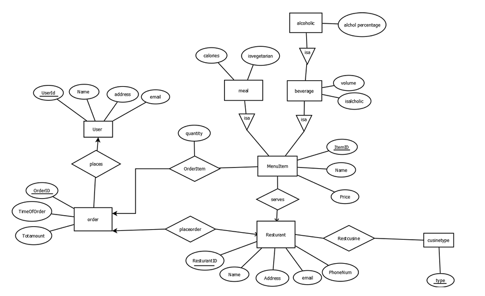
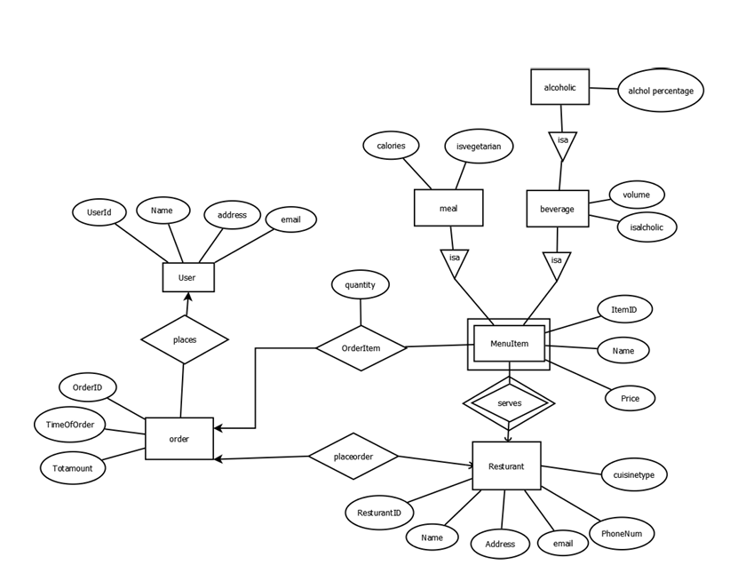

# Relational Database Design & SQL

Individual take-home project completed for the **DM505 Database Design** course at the **University of Southern Denmark (SDU)**.

## Overview

This project covers the design and analysis of relational databases, from conceptual E/R modelling to SQL querying, relational algebra, normalization, and indexing.

The work includes:

- E/R modelling and relational schema design
- weak entities and ISA hierarchies
- SQL joins, aggregation, and nested queries
- relational algebra
- functional dependencies and candidate keys
- Third Normal Form (3NF)
- Boyce-Codd Normal Form (BCNF)
- PostgreSQL-style indexing

The project combines practical SQL work with the theoretical foundations of relational database design.

---

## 1. E/R Modelling & Relational Design

The first part models an online restaurant-ordering system involving:

- users
- restaurants
- orders
- menu items
- cuisine types
- meals
- beverages
- alcoholic beverages

The conceptual model includes:

- one-to-many and many-to-many relationships
- referential integrity constraints
- ISA hierarchies
- relationship attributes
- entity and relationship keys

### Initial E/R Model

The initial model represents the relationships between users, orders, restaurants, menu items, and cuisine types, together with the ISA hierarchy connecting `MenuItem`, `Meal`, `Beverage`, and `Alcoholic`.



*Initial E/R model of the restaurant-ordering system.*

The E/R model was subsequently translated into a relational schema.

The complete relational-model documentation is available here:

[`docs/relational_model.md`](docs/relational_model.md)

### Modified Design

A second version of the model introduces two additional constraints:

1. Each restaurant belongs to exactly one cuisine type.
2. `ItemID` identifies a menu item only within a particular restaurant.

As a result, cuisine type becomes an attribute of `Restaurant`, while `MenuItem` becomes a **weak entity** dependent on `Restaurant`.

The corresponding composite identifier is:

`(RestaurantID, ItemID)`



*Modified E/R model where `MenuItem` becomes a weak entity identified by `(RestaurantID, ItemID)`.*

The corresponding relational schema was also modified so that the composite identifier is propagated to the dependent relations.

---

## 2. SQL Queries

The SQL component uses a publishing database involving authors, books, genres, and publishers.

The exercises require the use of:

- `SELECT`
- `JOIN`
- `LEFT OUTER JOIN`
- `GROUP BY`
- `HAVING`
- aggregate functions
- nested queries
- correlated subqueries
- `UNION`
- `ALL`
- set-based reasoning

Example tasks include:

- counting books per genre
- identifying publishers with at most a specified number of books
- finding authors who have not written books belonging to a given genre
- finding authors with the maximum and minimum number of written books
- comparing publishers according to the number of books they published

The submitted SQL solutions are available here:

[`sql/queries.sql`](sql/queries.sql)

---

## 3. Relational Algebra

The project also includes translation between **SQL and extended relational algebra**.

Operations covered include:

- projection
- selection
- joins
- outer joins
- set difference
- intersection
- grouping
- aggregation
- duplicate elimination

This section focuses on the relationship between declarative SQL queries and their underlying relational operations.

The relational-algebra documentation is available here:

[`docs/relational_algebra.md`](docs/relational_algebra.md)

---

## 4. Functional Dependencies & Normalization

A relational schema was analysed through its functional dependencies.

The workflow includes:

1. identifying non-trivial functional dependencies
2. computing attribute closures
3. identifying candidate keys
4. checking Third Normal Form
5. decomposing the relation into **3NF**
6. analysing the stricter **BCNF** condition
7. constructing a BCNF decomposition

The candidate key identified in the submitted analysis is:

`{CuisineType, OrderTime, UserID, ItemID}`

The normalization analysis demonstrates how functional dependencies can be used to identify redundancy and restructure a relational schema.

The complete analysis is available here:

[`docs/normalization.md`](docs/normalization.md)

---

## 5. Database Indexing

The final part of the project focuses on database indexing using PostgreSQL-style syntax.

Indexes were defined for attributes and relations including:

- publishers
- books
- genres
- authors
- book–genre relationships
- book–author relationships

Example:

```sql
CREATE INDEX BookGenreInd
ON BookGenre(ISBN, GenreID);
